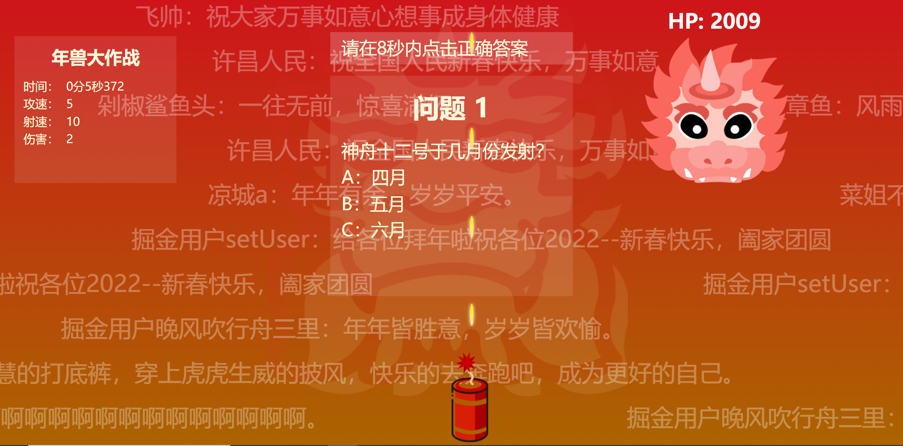
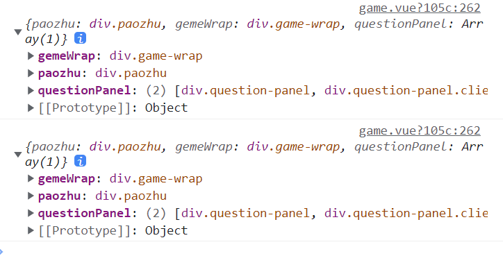
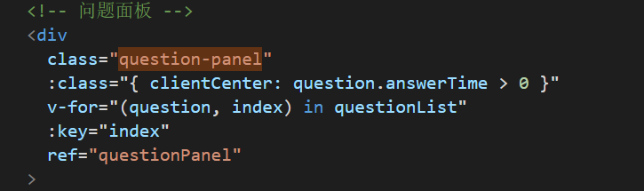
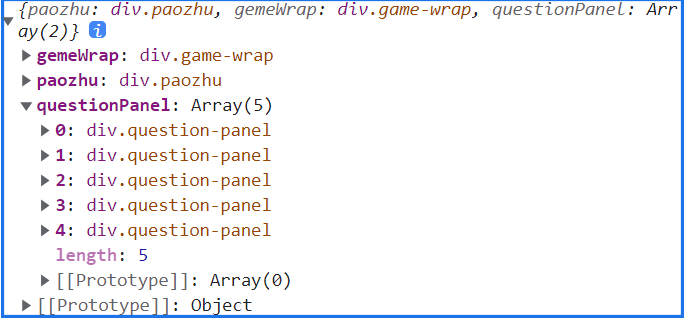
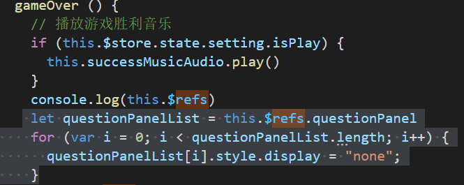

# new-year-game

[源地址](https://github.com/heyongsheng/new-year-game)

### 第一天

这次是一个打年兽外加答题的纯vue项目。另外使用了vuex做资源统一管理。

附加的就是弹幕效果，看起来就是一个很简单的vue项目。

我觉得对我的主要作用就是vuex的复习加上弹幕效果的实现




```mermaid
```

### 第二天

#### menu.vue

模板结构：

```tex
-div.menu-wrap				//总
--div.gz-wrap				//制作者信息
----img
----p
--div.title					//游戏标题
----img
--div.menu-box				//菜单内容区
----div.menu-item(v-for)			//菜单项清单

--transition.fadeUp			//自带组件，实现元素的过渡效果
----div.dialog(v-show)		//展示文本
--------p
----div.dialog-footer		//底部
--------div.footer-btn close-btn	//关闭展示区

--transition.fadeUp			//自带组件，实现元素的过渡效果
----div.dialog(v-show)		//展示文本
--------p
----div.dialog-footer		//底部
--------div.footer-btn close-btn	//关闭展示区

--transition.fadeUp			//自带组件，实现元素的过渡效果
----div.dialog(v-show)		//展示文本
--------p
----div.dialog-footer		//底部
--------div.footer-btn	
--------div.footer-btn close-btn
```


### 第三天

项目的关键在于vuex的使用，在`./store/store.js`文件中使用了vuex插件，同时，在项目`main.js`文件中引入了vuex，在挂载app的同时，也注入了store，这就可以使用$store了。

在store.js里，主要对音乐播放和弹幕开启做了管理。

管理音乐播放使用了一个Web API接口`HTMLAudioElement`,用于对< audio>元素的属性访问及操作。这个借口基于并从`HTMLMediaElement` 接口继承属性和方法。

[MDN 相关介绍](https://developer.mozilla.org/zh-CN/docs/Web/API/HTMLAudioElement)

它的构造函数是`Audio()`,可以创建并返回一个新的`HTMLAudioElement`对象，如果提供音频URL，就会开始加载音频文件。

我看到的效果是原作者已经打包放在dist文件夹里面的产出品，经过了`run build`,貌似是写在js里面的最后会自动转换为< audio>元素

```
<audio preload="auto" src="media/back.adb88244.mp3" loop=""></audio>
```

需要注意的是，所有的这些都在`export default`之外写着，那是不是写在其他js文件也是可以呢，甚至是vue文件里面？？？？

管理弹幕开启

这里仅仅放置了一个开关，弹幕功能更多放在vue组件里面实现。


这里的参数位置  `{ commit }`，我记得是防止被HTML转义，因为这里的commit指的是commit方法,如果去掉了就变成了毫无意义的形参。

在官方文档里面，是这样解释的：

> 实践中，我们会经常用到 ES2015 的 [参数解构 (opens new window)](https://github.com/lukehoban/es6features#destructuring)来简化代码（特别是我们需要调用 `commit` 很多次的时候）：

```js
actions: {
    increment ({ commit }) {
      commit('increment')
    }
  }
```

然而，文件里面的mutations:{}对象里面并没有increment函数，我不明白这个actions：{}对象里单独设置这个increment方法的意义。

### 第四天

控制弹幕的组件bullet-chat.vue

组件模板只有一个div语句

```html
<div class="bullet-chat-wrap" ref="bulletChat"></div>
```

这里使用了ref属性，用来在组件里面控制标签，也就是真实的DOM元素。

这也就意味着，组件的方法里面几乎都是直接操作了DOM，这样的写法我现在觉得是很不妥的，看看能不能后期改善一下。

`ref` 被用来给元素或子组件注册引用信息。引用信息将会注册在父组件的 `$refs` 对象上。如果在普通的 DOM 元素上使用，引用指向的就是 DOM 元素；如果用在子组件上，引用就指向组件实例：

```vue
<!-- `vm.$refs.p` will be the DOM node -->
<p ref="p">hello</p>

<!-- `vm.$refs.child` will be the child component instance -->
<child-component ref="child"></child-component>
```

>  关于 ref 注册时间的重要说明：因为 ref 本身是作为渲染结果被创建的，在初始渲染的时候你不能访问它们 - 它们还不存在！`$refs` 也不是响应式的，因此你不应该试图用它在模板中做数据绑定。

mounted保证vue实例被挂载后使用了showBullet方法

methods对象里面包括两个方法：showBullet和createBullet

showBullet( )方法

创建10个弹道	

随机删除一条弹道并从新的数组中选择第一条数据，然后往里面填充弹幕`this.ballisticArr.splice(randomIndex,1)[0]`

`this.createBullet(ballisticIndex)`

然后继续填充弹幕，这里使用了setTimeOut的异步执行方法，等待随即时间

`setTimeout(ballisticLaunch,Math.random()*1000)`，直到弹道数组为空数组。


未完，2022年1月30日23:03:41，明天就是过年了。歇会儿，现在弟弟胀痛，难受。


### 第五天

2022年2月2日20:06:21

### 第六天

2022年2月3日10:51:15

在`game.vue`里面，用到了大量方法。

首先是一局游戏用到的相关属性

```js
hoverMusic: require('@/assets/mp3/hover.wav'),
clickMusic: require('@/assets/mp3/click.wav'),
successMusic: require('@/assets/mp3/success.mp3'),
successMusicAudio: null,
questionJson: require('@/assets/data/question.json'), //问题源数据
questionData: [], // 当前轮题库
userBlessingData: require('@/assets/data/userBlessing.json'),// 用户祝福
userBlessing: {},
questionList: [],// 问题列表
gameBeginTime: 0, // 游戏开始时间
gameDuration: 0, // 游戏持续时间
clientX: 0, // 鼠标上次的位置
paozhuLeft: document.documentElement.clientWidth / 2, // 炮竹距离左边的距离
nianshouLeft: 0, // 年兽距离左边的距离
nianshouInterval: null, // 年兽移动的定时器
nianshouHP: 2021, // 年兽的血量
screenWidth: document.documentElement.clientWidth, // 屏幕宽度
screenHeight: document.documentElement.clientHeight, // 屏幕高度
nianshouMoveDir: 4, // 年兽移动的方向
createBulletInterval: null, // 创建子弹的定时器
frequency: 5, // 发射子弹频率
bulletSpeed: 10, // 子弹飞行速度
damage: 2,// 子弹攻击力
lastBulletTime: 0, // 上次发射子弹时间
resultBtnData: [
        {
          name: '再来一次',
          clickHandle: () => {
            this.successMusicAudio.pause()
            this.gameBegin()
          }
        },
        {
          name: '返回首页',
          clickHandle: () => {
            this.successMusicAudio.pause()
            window.backMusic.currentTime = 127.2
            this.$emit('backToHome')
          }
        },
        {
          name: '搭建过程',
          clickHandle: () => {
            window.open('https://juejin.cn/post/7051464086722183205/')
          }
        },
        {
          name: 'gitee',
          clickHandle: () => {
            window.open('https://gitee.com/ihope_top/new-year-game')
          }
        },
        {
          name: 'github',
          clickHandle: () => {
            window.open('https://github.com/heyongsheng/new-year-game')
          }
        }
      ]
    }
  },
```

在`mounted`方法里面加载音乐

```js
this.successMusicAudio = new Audio(this.successMusic)
this.successMusicAudio.loop = true
this.successMusicAudio.volume = 0.5
this.successMusicAudio.load()
```

在`methods`对象里面定义了诸多方法

```js
gameBegin () { }
gameOver () { }
addMove () { }
moveFunc () { }
removeMove () { }
nianshouMove () { }
createBullet () { }
formatTime () { }
addQuestion () { }
answerQuestion (answer,question) { }
```

### 第六天

2022年2月4日16:25:57

在`bullet-chat.vue`里，使用appendChild()方法

appendChild() 方法向节点添加最后一个子节点。

在data里面定义了数据部分

```js
blessingData:require('../assets/data/blessing.json'),
ballistic:0,    //弹幕数量
bulletSpeed:2,  //弹幕速度
bulletInterval:[300,500],    //弹幕间隔
screenWidth:document.documentElement.clientWidth,   //屏幕宽度
screenHeight:document.documentElement.clientHeight  //屏幕高度
```

在methods里面有以下方法

```js
showBullet()	//里面含有createBullet，当调用时，先取弹幕，在ballistcLaunch方法中执行创建弹幕方法。先取到一个随机数，然后执行创建方法，最后异步执行随机弹道弹幕添加方法ballistcLaunch
createBullet()	
```

### 第七天

2022年2月9日10:23:29


`game.vue`组件里面中的template内容

总组件---------game-wrap       有ref方法，v-on监听mouseup(removeMove方法),

分组件----------nianshou		绑定Style，v-show方法(年兽血量不为零展示)

​			p、img

分组件-----------paozhu		ref方法，v-on监听mousedown(addmove方法)，Style绑定

​			img

分组件-----------panel-wrap

​		游戏面板区域------------game-panel panel-item		

​						标题年兽大作战，时间、攻速、射速、伤害

​		问题面板------------question-panel panel-item 		Class绑定，v-for展示问题，v-bind

​				倒计时-----------show-count-down

​				问题展示--------question-wrap

​						这里的回答问题---answer-item 使用v-for展示问题，用@mouseover($store.commit('playAudio', hoverMusic)),传递点击音乐，@click(answerQuestion(item.key, question))传递答案和问题

​						结果展示---------answer-wrap result

​						buff--------------v-if 回答正确

​						desc-------------v-if 展示答案

分组件------------result-box		v-show(年兽血量为零展示)

​			祝福语区域，遗憾的是，这里作者没能把回答过的问题清空，最后的结果显得杂乱。

我的想法是,Style绑定，当年兽血量为零之后隐藏这些问题面板。

在向question-panel panel-item中添加` :style="'display:'+'none'"`，之后，问题区域全部消失，我想让它只在年兽血量为零时才会触发这个效果。vuex可不可以实现呢？

答案是不可以。Vuex 是一个专为 Vue.js 应用程序开发的**状态管理模式 + 库**。它采用集中式存储管理应用的所有组件的状态，并以相应的规则保证状态以一种可预测的方式发生变化。

这就说明，vuex是管理组件的，我要实现的效果是更改DOM元素，应该直接在DOM所在的组件里面实现更改。

那么可以试试ref。在question-panel panel-item中添加ref=“questionPanel”，刚好methods里面有gameover()方法，直接在第一行执行`this.$refs.questionPanel.style.display = 'none'`

实现了，问题是，我放的位置不对，应该放到最后一行。

结果也不对，反复试验之后明白了，我为了更快结束游戏，将伤害提高到50，他这个游戏的问题区域没有将这个考虑在内。看来不是我放置的位置不对，他就是没考虑到这个方面。

我打印了this.$refs（不知道为什么执行两次···）



原DOM如下：



> 这张图里面，我改了class名字，与源代码不一致。

可以看到它使用了Class绑定，NND，就是这个把questionPanel变成了一个对象，导致`this.$refs.questionPanel.style.display = 'none'`这段代码无法执行，我想应该是可以执行的，但就是不知道为什么不可以。

所以说，如果想要对多个对象执行，就要用循环咯

https://www.cnblogs.com/Indomite/p/14195248.html





这样之后，就可以在游戏结束后，清空展示状态的问题了。自然，由于他这个代码忽略将游戏结束与问题展示相关，像我这种伤害爆炸的外挂就会出现bug。

原伤害是肯定不会出现bug的

问题解决！！！！！！！！！！！！！


迟到了好多天的新年祝福！！！！！！！！！！！！！！！！！！！！！！！！！！！！！！！！！！！！！！！！！！


